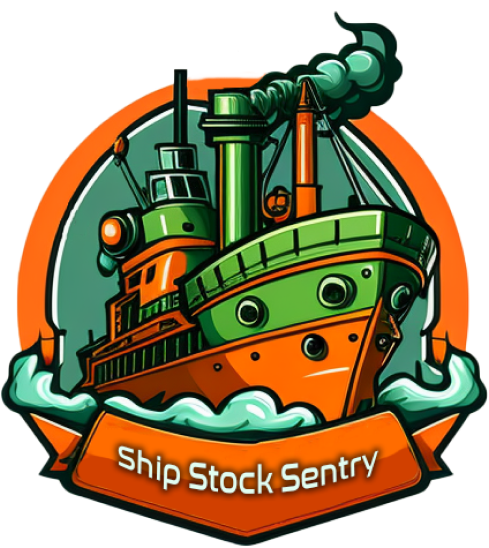

  

# Ship Stock Sentry 🚢

Ship Stock Sentry is an application that allows users to monitor the consumables of a drilling ship. It provides the ability to log in, view all remain on board (ROBs), create new ROBs, edit existing ones, and delete ROBs. The back-end of the application is built using Flask.

The front-end of the application can be found in the following repository: [https://github.com/fernandopredes/ShipStockSentry-front](https://github.com/fernandopredes/ShipStockSentry-front)

## Features 🚀

- View all ROBs on board the drilling ship, including information on the type of consumable and available quantity.
- View consumables by tank levels, such as fuel, water, barite, bentonite and limestone, to help manage and monitor usage.
- Create new ROBs to the list, providing details about the type of consumable and quantity available.
- Edit existing ROBs to update available quantities or make other changes.
- Delete ROBs that have been used or are no longer needed.

## Installation 🧰

To use Ship Stock Sentry locally, follow these steps:

1. Create a virtual environment by running `python -m venv venv` in the terminal.
2. Activate the virtual environment by running `source venv/bin/activate` on Unix or `venv\Scripts\activate` on Windows.
3. Install the required dependencies by running `pip install -r requirements.txt`.
4. Start the back-end server by running `flask run` in the terminal. This will start the Flask server on `http://localhost:5000`.
5. Access the API documentation by navigating to `http://localhost:5000/swagger-ui` in your web browser.

## Usage

Before you can use the Ship Stock Sentry application, both the back-end and front-end of the application must be running. Here are the steps to use the application:

1. Start the back-end server by running `flask run` in the terminal. This will start the Flask server on `http://localhost:5000`.
2. In a separate terminal window, navigate to the front-end directory and follow the instructions in the front-end repo readme.md file to start the front-end application.
3. Register and log in to the application to view all ROBs on board the drilling ship. From there, you can create new ROBs, edit existing ones, and delete ROBs as needed. You can also view consumables by tank levels to help manage and monitor usage.

## Contributing

If you would like to contribute to Ship Stock Sentry, please open a pull request or issue on the GitHub repository.
